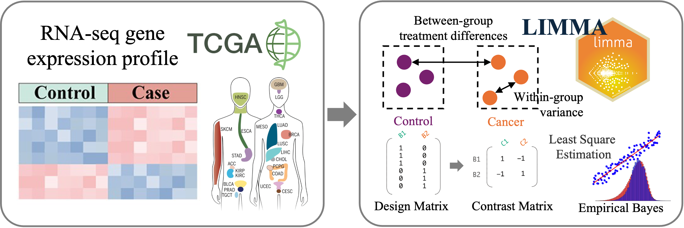
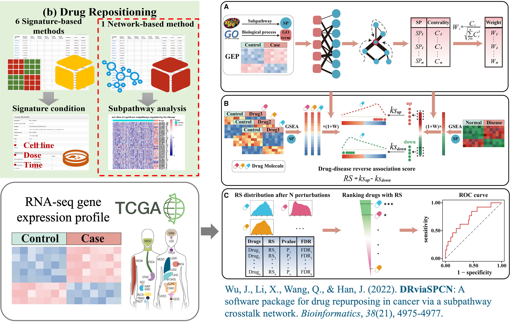
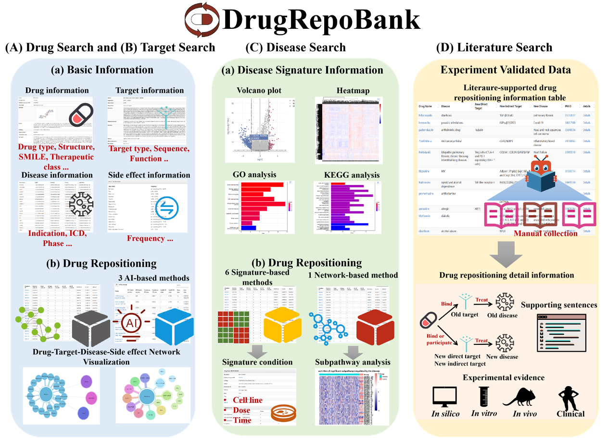

# DRviaSPCN Application for Drug Repositioning in Cancer

This repository contains demo data and source code for identifying **Differentially Expressed Genes (DEGs)** and performing **drug repurposing** using the **DRviaSPCN** method, based on cancer transcriptomic data from **The Cancer Genome Atlas (TCGA)**.

---

## 📊 Data Source

We conducted differential expression analysis using data from **The Cancer Genome Atlas (TCGA)**  
🔗 [Xena Browser link](https://xenabrowser.net/datapages/?host=https%3A%2F%2Ftcga.xenahubs.net&removeHub=https%3A%2F%2Fxena.treehouse.gi.ucsc.edu%3A443)

- TCGA is a collaboration by the **National Cancer Institute (NCI)** and the **National Human Genome Research Institute (NHGRI)**.
- The dataset includes >11,000 tumor and matched normal tissues from **33 cancer types** (38 cohorts).
- Sample types were labeled as **"Cancer"** or **"Normal"** using TCGA sample type codes  
  🔗 [Sample type codes](https://gdc.cancer.gov/resources-tcga-users/tcga-code-tables/sample-type-codes)
- Only cancer types with both tumor and normal samples were included in the analysis.

Demo files for UCEC (Uterine Corpus Endometrial Carcinoma) are provided:
- `DEG-analysis/UCEC_HiSeqV2.csv` — normalized gene expression matrix.
- `DEG-analysis/UCEC_experiment.csv` — sample annotations (Cancer vs. Normal).  
Other cancer types can be downloaded from the [TCGA portal](https://portal.gdc.cancer.gov/).

---

## 🧬 DEG Analysis using LIMMA

We applied the **LIMMA** package for differential expression analysis:

1. Constructed a **design matrix** and **contrast matrix** to compare tumor vs. normal.
2. Fitted a linear model (`lmFit`) and applied **empirical Bayes moderation**.
3. Identified DEGs with:
   - Adjusted p-value < 0.05
   - |log2 Fold Change| > 1

🔍 DEGs were categorized as **up-regulated** or **down-regulated**.

📈 Visualizations include:
- Volcano plots using `ggvolcano`
- Heatmaps using `pheatmap`

🖼️ Method overview:

---

## 💊 Drug Repurposing using DRviaSPCN

We used **DRviaSPCN**, a software tool for **drug repurposing in cancer**, based on subpathway crosstalk analysis.

### Key steps:

- Calculate SP centrality scores via `CalCentralityScore`.
- Weight SP enrichment scores using centrality.
- Assess **drug-disease reversibility** at the SP level.

### Output files:
- `cancername_CentralityScoreResultOutput.csv` — SPs with centrality scores and statistical significance.
- `cancername_Opdrugresult.csv` — Predicted drug results including:
  - Drug Enrichment Score (DES)
  - p-value
  - FDR

### Parameters:
- `topcut = 10`
- `pcut = 0.01`
- `nperm = 1000`

Heatmaps were generated using the `Disease2SPheatmap` function to visualize significant subpathways (p < 0.05).

🖼️ Method overview:

---

## ✅ Output Example

If the pipeline runs successfully, you should obtain:

- `DEG-analysis/UCEC_allGene.csv`: LIMMA output with DEGs and statistics.
- `Drug-repurposing/UCEC_CentralityScoreResult.csv`: Drug-SP centrality score results.

---

## 📦 About DrugRepoBank

> This code is part of the **DrugRepoBank** platform – a comprehensive database and discovery toolkit for accelerating drug repositioning.

🌐 Explore more at: [https://awi.cuhk.edu.cn/DrugRepoBank](https://awi.cuhk.edu.cn/DrugRepoBank)

🖼️ Website overview:

---

## 📬 Contact

For questions or feedback, please contact the DrugRepoBank team via the official website or raise an issue on this repository.

